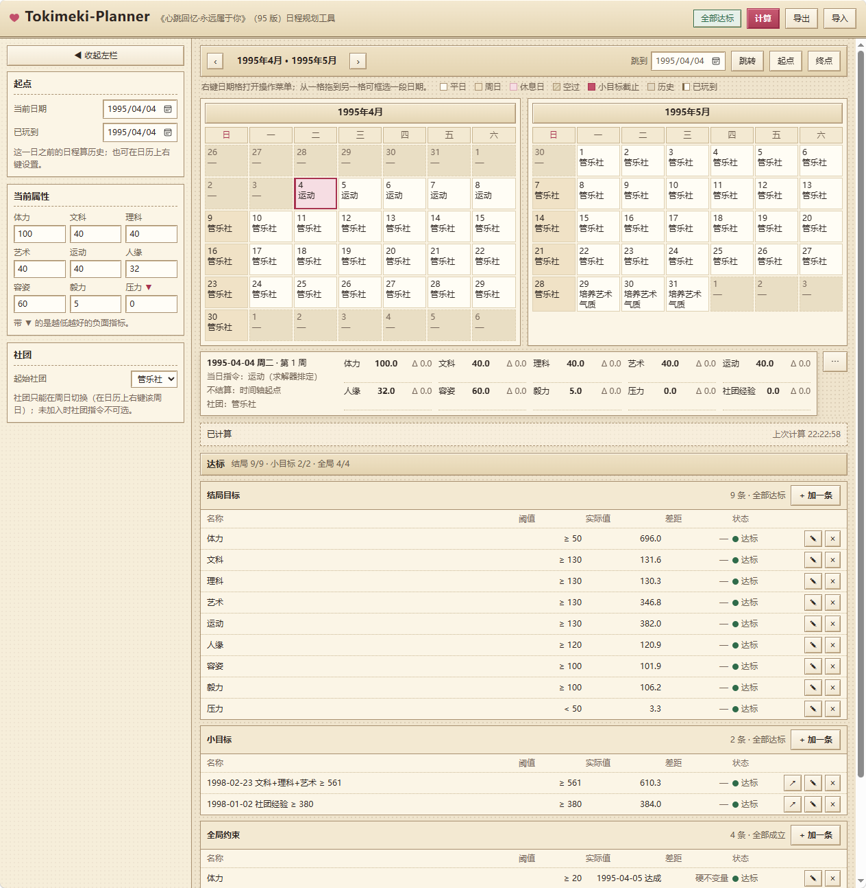

# Tokimeki-Planner

《心跳回忆·永远属于你》（95 版）日程规划工具：在固定的时间轴上安排指令，使属性在结局时达到你指定的目标。

A dependency-free, single-file scheduling planner for *Tokimeki Memorial: Forever With You* (1995). It searches for a week-by-week schedule that drives nine character attributes toward your targets by graduation day. Everything runs locally in the browser — no install, no network, no data leaves your machine.



---

## 1. 这是什么

一个**单文件、零依赖、不联网**的网页应用，回答一个问题：

> 从某个存档点出发，每周该下什么指令，才能在毕业时把九项属性推到目标值？

它做三件事：

- 在「已玩到 → 毕业日 1998-03-01」的完整区间上搜索达标排程；
- 把结果画成**双月日历**——决策单位是周，所以日历的每一行正好是一个自然周；
- 算不出结果时，如实报告**未达标**：达标清单逐条标出哪一项没达到。

它**不是**存档修改器：不读、不写、不解析任何游戏存档（见 `docs/adr/0001-clean-room.md`）。

---

## 2. 直接用

### 在线使用

打开 <https://ouro-tomosho.github.io/Tokimeki-Planner/> ——打开后点右上角**「计算」**即可看到一份示例排程。

示例用的是**出厂默认数据**（见 `data/rules.json`），其中**默认没有加入社团**。所以点「计算」后你会看到**结局目标 9/9、全局约束 4/4 全部达标**，但整体状态是**「未达标」**——因为默认小目标里有一条「1998-01-02 社团经验 ≥ 380」，而没加入社团时社团经验恒为 0，这一条必然达不到。在日历上右键任意一个周日加入社团，或者改掉这条小目标即可。

### 离线使用

到 [Releases](https://github.com/ouro-tomosho/Tokimeki-Planner/releases) 下载 `Tokimeki-Planner.html`，**双击打开**即可。整个应用就是这一个文件，拷到任何地方都能跑，断网也能跑。

### 从源码构建

需要 Node.js ≥ 22，无任何第三方依赖：

```bash
npm run build   # 把 web/ + src/ + data/ 内联成仓库根目录的 index.html
npm test        # 内核、构建产物与内联代码的冒烟验证
```

构建产物是确定性的（两次构建逐字节相同），并且测试会断言**磁盘上的产物等于一次新鲜构建**——所以改了源码忘记重新构建，测试会直接变红。

---

## 3. 功能介绍

### 双月日历（结果视图）

- **周日起排**，两个月并排：日历的一行＝一个自然周，该周的周指令一眼就是一个整体。
- 每个格子里写着**当天实际执行的指令**，不用心算"这周跑的是什么"。
- 格底五态一眼可分：**平日 / 周日 / 休息日 / 空过 / 时间轴外**。终点 `1998-03-01` 可选中并标注「终点」，但它不结算。
- 翻页（上月 / 下月）+ 日期选择器直达 + 跳到起点 / 跳到终点，在整条时间轴（1995-04 → 1998-03，共 36 个月）里移动。
- 每一条小目标在它的**截止日画一面旗**：红旗＝达标、白旗＝未达标。一格最多并排 4 面，第 5 面起收成 `⚑N` 角标。
- **「已玩到」就是时间轴的起点**：日历从它开始，它当天不结算（那一天的结果已经在游戏里发生过了）。
- **周日与休息日的日期数字是红色的**，取星期栏「日」的同一个颜色——一周里哪几天要单独下指令，一眼可见。

### 选中与当日详情

- **点一天**，就在正下方看到那天的详情，不必滚动：日期、星期、第 N 周，当天的指令**及其来源**（日指令 / 周指令 / 空过），以及**10 项数值**（9 项属性 + 社团经验）的结算后值与当日 Δ。
- **框选**：从一格拖到另一格，按日期连续取范围，跨周跨月都成立，用于批量操作。

### 编辑

- **右键日期格**打开操作菜单：指定指令、切换社团（仅周日）、设为 / 取消休息日、跳过 / 取消跳过、添加小目标、管理这一天的小目标、设为已玩到。`Esc` 或点别处关闭，`Shift+右键` 放行浏览器原生菜单。
- 在**平日**上改指令，等于改**本周的周指令**——只要选区碰到某个周的任何一天，那个周的周指令就改；改完本周全部平日会亮一下，让你知道刚才那一手影响了整整一周。
- 框选后「设为已玩到」取**选区的最后一天**："我玩到这儿了"只能是最后一天。
- **「设为已玩到」会把时间轴起点推到那一天**：起点、当前属性、起始社团与社团经验一起对齐到"那一天结算之后"。属性按游戏口径向下取整，之后随时可以手动改（游戏里有成败随机，实际值可能与计划值不同）。**还没有计算结果时**只移动日期，属性与社团保持原样，并明确告诉你这一点。

### 左栏

- 只有一个日期输入：**「已玩到」**。合并之后它就是时间轴起点，不再有第二个日期。
- **当前属性**一栏是 10 个数字：9 项属性 + **社团经验**。它们是"起点那一刻的状态"，可逐格手动修改。

### 目标与计算

- **目标编辑与达标状态合在一处**：下方达标清单的每一行就是「阈值 + 实际值 + 差距 + 状态」，行内即可编辑；小目标行带「跳到该日」。
- 三类目标分开列出：**结局目标**（终点处必须达到）、**小目标**（某个日期之前的属性集合求和阈值）、**全局约束**（每一次每日结算都要满足的阈值）。
- **行序固定，不随增删乱跑**：结局目标与全局约束按属性次序（体力→…→压力），小目标按截止日期从早到晚。排序只影响显示，导出的 JSON 保持你录入的顺序。
- **每次计算都是整份重排**：时间轴从「已玩到」开始，它之前没有日程可改写，因此不需要"冻结前缀"那套机器（见 [ADR-0004](docs/adr/0004-frontier-is-played-up-to.md)）。
- **排不出达标日程时不猜原因**：状态栏显示「未达标」，达标清单逐条标出哪一项没达到。

### 计算

- **不自动重算**：改动只标记「N 处改动待计算」，点「计算」才重排。改动期间日历上的属性数值、旗帜颜色、达标清单都会标为**陈旧**（降饱和 + 虚线边框），提醒你那是上一次计算的结果。
- 求解期间显示**不确定进度条 + 已用计时**，可随时取消。
- **本地运行，零联网**：产物内不含任何外链资源——没有 CDN、没有外链字体、没有图片文件，界面全部由内联 CSS 与内联 SVG 绘制。测试会机械断言 `https?://`、`<link>`、``、`@import`、`url()` 的命中数为 0。
- **输入自动保存在本机**：刷新、关掉再打开，起点日期、当前属性、社团与社团切换、休息日、跳过、显式指定的指令、四类目标都还在。**计算结果不保存**——刷新后是「尚未计算」，点一下「计算」即可（求解是确定性的，重算结果与刷新前完全相同）。浏览器禁止本地存储时（隐私模式，或某些浏览器打开本地文件）自动降级为不保存，应用照常可用。
- 输入可以**导出 / 导入 JSON**，方便保存与复现一次规划。导出文件名就是你标记的**已玩到日期**（例如 `1996-05-01.json`），多份文件一眼分得清。

### 计算口径

- 决策单位是**周**，结算单位是**天**。
- **成功率**：当前全部指令为 63%；**休息指令永远成功**，不参与判定。
- 本项目按**期望值**做确定性计算，**不做随机模拟**——同一输入连续求解两次，结果完全相同。
- **休息日**（周日，以及你标记为休息日的任意一天）执行自己的日指令，不执行本周指令；日常指令上升效果 ×4、社团指令上升效果 ×6。
- 属性被夹在 `[0, 999]`；**压力**是唯一"越低越好"的负面指标，它在指令失败时不参与上升幅度减半。

---

## 4. 声明和许可

### 非官方声明

本项目是**非官方的粉丝工具**，与 **Konami（科乐美）及其关联公司没有任何关系**，未获其授权、赞助或认可。

《心跳回忆》（Tokimeki Memorial）及相关游戏名称、角色名、术语的著作权与商标权，归其各自权利人所有。本仓库对这些名称的**指示性使用**，仅为说明工具用途。

### 不含游戏素材

**本仓库不包含任何游戏素材**——没有图片、音频、字体或从游戏中提取的数据文件。全部界面元素由内联 CSS 与内联 SVG 绘制；测试会断言产物中不存在任何外部资源引用。

### 数据来源

全部领域数据（九项属性、18 条指令、成功率、社团、阈值）**由仓库所有者手工录入并确认**，记录在 `data/rules.json`，来源清单与反解算式的记录见 `docs/data-request.md`。其中单日指令效果表由所有者实测的**三周总量**按结算规则反解而来（口径写在 `docs/data-request.md` 第 2 节）。本项目**不引用任何其它项目的领域数据、术语表、公式系数、算法选型或设计文档**，也不读写游戏存档——这条边界记录在 `docs/adr/0001-clean-room.md`。

因此，仓库内的数据是**独立推导的领域建模结果**，不是从游戏文件中提取的资产。

### 许可

代码以 **MIT 许可证**发布，全文见 [LICENSE](LICENSE)。

以上声明不修改、也不限制 MIT 许可证授予你的权利；它只是说明本项目的性质与归属边界。
